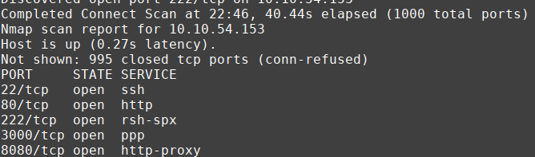

# Cats 2

My refresher and my first CTF challenge in THM

## Table Of Contents

1. [Flag 1](#flag-1)
2. [Flag 2](#flag-2)
---
# Steps

First i scanned the IP using nmap
>nmap 10.10.54.153 -v

Giving me these outputs

Knowing port 80 is open i immediately open http://{ip}

Quick preview of the site 

Scrimming through the album i saw this description

I extracted the metadata giving me this note

So i tried opening port 8080 with the note as url giving me this 

Opening port 3000 i got redirected to Gitea

---
# Flag 1
Quick scanning i found the First Flag

I then read the playbook.yaml but nothing interesting for now

now i tried the other open port from the note i got on port 8080 and tried opening the port 1337 

Not familiar with ansible, i did a quick google search and i found out that i can manipulate the playbook.yaml from earlier to execute some linux commands manipulating the ansible execution

first i tried to ls to show the directory contents 

Viola! i got the 2nd Flag

---
# Flag 2

Then i tried to cat flag2.txt giving me this 

---

# Flag 3

Not solve yet as i reached dead end
