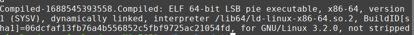
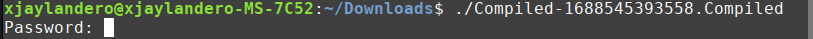
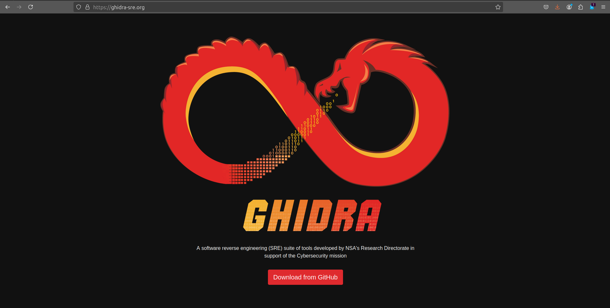
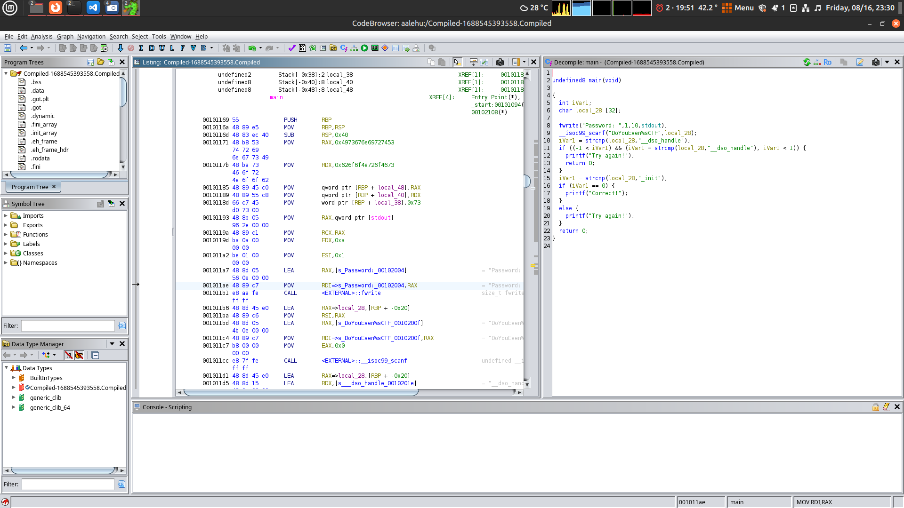
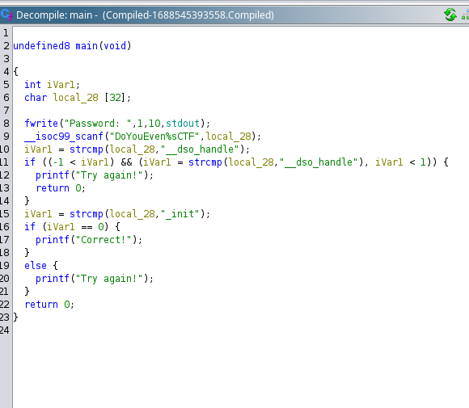
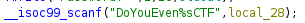
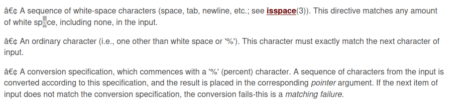
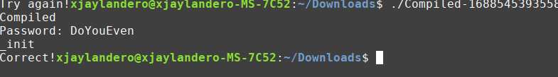

# Compiled

First reverse engineering challenge

## Tools i used
Ghidra

# Steps

First looking what type of file i'm dealing with

It's a executable file, running it prompt me for password

Didn't waste time to guess the password i tried different methods and tools like objdump, strings, objcopy. No luck, i can't read assembly instruction. I tried searching for a robust reverse engineering software, i found Ghidra

Quickly i made a project and ran the file

On the center screen, it shows the file in assembly instruction, on the right side is the decompiled source code

Analyzing the source code, it accepts input and stored it into local_28 which is a string of 32 bytes, there's a conditional statement there that if the input equals to '__dso_handle' it will exit the program. Next is the conditional statement if the string is equal to _init then i got the correct password.

## Dilemma

Looking again on where the userinput is stored

It uses scanf and what intrigue me is the 'DoYouEven%sCTF', quick search on what it does, it wraps my input between the string, so what the tricky part is how will this string be equal to '_init' if my input is wrapped between that string.

Half an hour i came across a documentation about scanf

It basically just saying the in scanf i can specify a string pattern with a '%' in it. Then if i input the exact string, enters a new line and input a string before the % part then that one will be stored in the local_28 variable instead of the whole placeholder.

And that's it the full password is:
>DoYouEven_initCTF